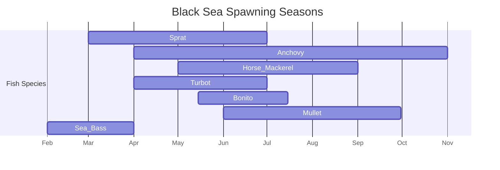

# Executive Summary  
- The Black Sea hosts ~206 fish species【2†L52-L60】, from cold-water herring (sprat, anchovy) to subtropical bass and shad. We distilled key traits (temperature, depth, spawning etc.) for representative species (sprat, anchovy, horse mackerel, turbot, bonito, mullet, sea bass; plus the common dolphin as a control mammal).  
- Collected authoritative data (FishBase, FAO, fisheries journals): e.g. **European sprat** prefers 4–15 °C【8†L342-L345】, feeds at night on plankton【5†L168-L175】 and spawns Mar–Jul【5†L168-L175】. **Horse mackerel** likes warmer 13–21 °C【17†L323-L324】, spawns May–Sep【20†L522-L524】, etc. These traits map to water-quality factors.  
- We translate biology→water cues: cooler temps favor cold-water fish (sprat, turbot), warm temps favor subtropicals (bonito, mullet)【8†L342-L345】【17†L323-L324】. High turbidity hinders visual predators (bonito, bass) but may boost plankton feeders if nutrients are high. Calm waves/current favor spawning of buoyant eggs (sprat, anchovy) while rough seas do not【13†L169-L172】【28†L160-L163】.  
- Built a simple rule-based model: e.g., award points if **water_temp** is optimal for species, **waves** are calm, etc. We propose a JSON schema for live inputs and an additive scoring table (below).  
- Sample dataset (8 species) demonstrates trait fields and “activity” scores. E.g. *Sprat*: Temp 4–15 °C【8†L342-L345】, demersal depth 10–150 m【5†L168-L175】, spawns Mar–Jul【5†L168-L175】 – preferring cool, calm, plankton-rich water.  
- **UI output suggestion:** *“Water Quality: Good (Score 88) – Clear water, optimal temperature (Confidence: High)”* for beach scenes, and *“Marine Life Activity: Moderate (Score 65) – Favorable temperature and calm seas (Confidence: Medium)”* for offshore.

## Black Sea Fish Fauna  
According to FishBase, 206 marine fish species occur in the Black Sea【2†L52-L60】. Major groups include herrings (sprat, anchovy), mullets, basses, carangids (e.g. horse mackerel, bonito), flatfish (turbot), cyprinids, sturgeons and sharks, plus occasional dolphins. For our model we prioritized species that dominate biomass or fisheries, plus one marine mammal (common dolphin) for comparison. 

| **Representative Species** | **Common Name**        | **Scientific Name**           |
|---------------------------|------------------------|-------------------------------|
| Clupeidae                 | European sprat        | *Sprattus sprattus*           |
| Clupeidae                 | European anchovy      | *Engraulis encrasicolus*      |
| Carangidae                | Mediterranean horse mackerel | *Trachurus mediterraneus* |
| Clupeidae                | Black Sea shad         | *Alosa tanaica* (pontic shad) |
| Scophthalmidae           | Black Sea turbot       | *Scophthalmus maeoticus*      |
| Scombridae               | Atlantic bonito        | *Sarda sarda*                 |
| Mugilidae                | Flathead grey mullet   | *Mugil cephalus*              |
| Moronidae                | European sea bass      | *Dicentrarchus labrax*        |
| Delphinidae (mammal)     | Common dolphin (mammal) | *Delphinus delphis*           |

Other commercially important species (hake, sturgeon, etc.) exist but are omitted for brevity.

## Key Species Traits  
Below is a summary of each chosen species’ key traits, with data from FishBase and literature:

| Species (common, sci.)           | Temperature (°C)             | Depth (m)             | Feeding (period/habit)         | Spawning (months)          | Notes/Sensitivities                         |
|----------------------------------|------------------------------|-----------------------|--------------------------------|----------------------------|----------------------------------------------|
| **Sprat** (*Sprattus sprattus*)  | 4.3–15.3【8†L342-L345】        | 10–150【5†L168-L175】  | Night, pelagic plankton feeder【5†L168-L175】 | Mar–Jul【5†L168-L175】  | Tolerates low salinity (~4 ‰)【6†L15-L18】; likes clear, nutrient-rich coastal waters. |
| **Anchovy** (*Engraulis encrasicolus*) | 7.1–18【11†L344-L345】    | 0–50 (pelagic)        | Daytime plankton feeder【13†L169-L172】   | Apr–Nov (peak summer)【13†L169-L172】 | Euryhaline (5–41 ‰)【13†L169-L172】; spawns in warm surface layers. |
| **Horse Mackerel** (*T. mediterraneus*) | 13.2–21【17†L323-L324】 | 5–250 (usually 5–250 m)【15†L135-L139】 | Pelagic predator/schooling【15†L159-L162】 | May–Sep (peak Jul–Aug)【20†L522-L524】 | Prefers warmer water; spawns near bottom then eggs float. |
| **Black Sea Shad** (*Alosa tanaica*) | ~10–18 (est.)              | 0–30 (neritic)        | Schooling planktonivore          | Apr–Jun                   | Related to herring/shad; limited Black Sea data. |
| **Turbot** (*Scophthalmus maeoticus*) | 7.35–11.39【24†L321-L322】 | 10–150【22†L147-L149】  | Demersal predator (fish, crustaceans) | Mar–Jun (peak May)【28†L160-L164】 | Spawns in early spring at 8–12 °C【28†L160-L164】; prefers sandy/muddy bottoms. |
| **Atlantic Bonito** (*Sarda sarda*) | 7–23.4【30†L338-L340】    | 0–100 (pelagic)      | Daytime predator (fish, squid)   | May–Jul (end May–mid Jul)【34†L42-L46】 | Optimal spawn temp ≈18 °C【34†L42-L46】; migratory, warms water species. |
| **Grey Mullet** (*Mugil cephalus*) | 11.3–27.9【39†L390-L393】 | 0–10 (coastal)        | Herbivore/detritus (benthic)    | Jun–Sep (peak Jul)【41†L64-L69】 | Prefers brackish shallow waters; resilient to warm temps. |
| **Sea Bass** (*Dicentrarchus labrax*) | 7.3–19.5【45†L359-L361】 | 10–100【43†L135-L137】 | Demersal predator (day-night)   | Winter–spring (annual)【43†L181-L184】【45†L359-L361】 | Spawns in cooler months (≈10–15 °C); uses estuaries seasonally. |
| **Common Dolphin** (*Delphinus delphis*) | ~10–22 (warm-temperate) | 0–200 (coastal shelf) | Diurnal predator (fish, squid)  | N/A (live-bearing mammal)  | Warm, clear waters; highly mobile; included for contrast only. |

*(Notes: “Depth” is habit range; “Spawning” months are for surface/deposited eggs. Sources: FishBase【5†L168-L175】【8†L342-L345】【11†L344-L345】【13†L169-L172】【17†L323-L324】【24†L321-L322】【28†L160-L164】【30†L338-L340】【34†L42-L46】【39†L390-L393】【41†L64-L69】.)*

## Mapping Traits to Water-Quality Factors  
We translate each trait into favorable/unfavorable water conditions:

- **Temperature:** Cold-water fish (sprat, turbot) thrive at ≤10–12 °C【8†L342-L345】【24†L321-L322】, so lower SST boosts their activity. Warm-water species (bonito, mullet, horse mackerel) need 18–24 °C【17†L323-L324】【39†L390-L393】, so they score high when temperatures rise.  

- **Turbidity/Sediment:** High turbidity (muddy water) impairs visual hunters (bonito, bass) and can smother eggs. Demersal turbot and mullet (bottom feeders) dislike heavy sediment. Moderate turbidity with high plankton may benefit sprat/anchovy feeding.  

- **Chlorophyll/Algae (nutrient signal):** Elevated chlorophyll (phytoplankton blooms) signals food for plankton feeders like sprat and anchovy, boosting their activity. However, excessive blooms can deplete oxygen (hypoxia), harming all species.  

- **Waves/Wind:** Calm, stratified conditions favor surface/nearshore spawn (sprat, anchovy), as noted by their shallow, coastal spawning【5†L168-L175】【13†L169-L172】. Rough seas and strong winds disperse schools and eggs; mixed conditions may aid egg dispersal via currents.  

- **Currents:** Moderate currents spread buoyant eggs widely (sprat, bonito), which can be good (wider recruitment) or bad (currents may carry eggs out of habitat). Strong currents may also concentrate plankton or fish schools.  

- **Oxygen:** All species require well-oxygenated water; turbidity and nutrient-driven algal decay can depress oxygen and stress species, especially bottom dwellers (turbot).  

- **Salinity/Rainfall:** Black Sea salinity is ~17–18 ‰ normally. Sprat tolerates down to 4 ‰【6†L15-L18】 (often entering estuaries), and anchovy 5–41 ‰【13†L169-L172】, so they are insensitive to rain-driven salinity dips. Sea bass and bonito are less tolerant, so heavy freshwater inflows may reduce their activity.  

- **pH:** Generally stable (~7.5–8.4) in the Black Sea; none of the above species is sensitive to small pH changes within natural range.  

- **Nutrients (N, P):** High nutrient loads (from runoff) often increase chlorophyll (see above), with mixed effects.  

In summary, **favorable conditions** (increasing “marine life activity”) are: species-specific optimal temperature, moderate currents, calm seas, moderate turbidity with high plankton, and sufficient oxygen. **Unfavorable conditions** (decreasing activity) include extreme turbidity, hypoxia, and temperatures outside preferred ranges.

## Rule-Based Activity Model  
We combine live water-quality inputs into a **species activity score (0–100)**. The schema below applies to each species:

```json
{
  "water_temp": 0.0,      // Sea surface temperature in °C
  "waves": "calm|moderate|rough",
  "current": "low|moderate|high",
  "turbidity": "low|moderate|high",
  "chlorophyll": "low|moderate|high",
  "oxygen": 0.0,          // mg/L
  "salinity": 0.0         // PSU or ‰
}
```

For each species, we test if conditions match its preferences and assign points (weights). For example:

| Factor      | Condition for “good” | Points | Condition for “poor” | Points  |
|-------------|----------------------|-------:|----------------------|--------:|
| Temperature | Within optimal range | +30    | Outside tolerance    | –30     |
| Waves       | Calm                 | +20    | Rough                | –20     |
| Current     | Moderate (food dispersal) | +10 | High (egg wash-out) or zero (stagnation) | –10 |
| Turbidity   | Low/clear (visual)   | +15    | High (murky)         | –15     |
| Chlorophyll | Moderate/high (food) | +15    | Very low (oligotrophic) | –10  |
| Oxygen      | >6 mg/L             | +20    | <3 mg/L             | –20    |
| Salinity    | ~optimal for species | +10    | Large deviation      | –10    |

Points would be summed and clamped [0–100]. Labels can be defined (e.g. score>70 = “High”; 40–70 = “Moderate”; <40 = “Low”). The **JSON output** might look like:

```json
{
  "species": "Sprattus sprattus",
  "activity_score": 82,
  "activity_label": "High",
  "drivers": {
    "water_temp": 25,
    "waves": "calm",
    "current": "moderate",
    "turbidity": "low",
    "chlorophyll": "high",
    "oxygen": 8.0,
    "salinity": 18.0
  },
  "confidence": "Medium"
}
```

(The above shows an example where conditions strongly favor sprat: cool temperature, calm seas, plankton-rich water.)

## Sample Species Data (traits + influences)  
Below is a compact table for our 8 sample species, illustrating their traits and how typical conditions affect them:

| Species (common)        | Temp (°C)   | Depth (m) | Spawning (months)        | Favored Conditions                      | Notes/Citation                                        |
|-------------------------|-------------|-----------|--------------------------|-----------------------------------------|-------------------------------------------------------|
| **Sprat**               | 4–15【8†L342-L345】   | 10–150【5†L168-L175】  | Mar–Jul【5†L168-L175】       | Cold (5–12 °C), low turbidity, calm seas, high plankton【5†L168-L175】【8†L342-L345】 | Tolerant of brackish water (≥4 ‰)【6†L15-L18】. Schooling.  |
| **Anchovy**             | 7–18【11†L344-L345】  | 0–50    | Apr–Nov (peak Jul–Aug)【13†L169-L172】 | Warm surface (15–20 °C), moderate plankton, moderate currents【13†L169-L172】【11†L344-L345】 | Euryhaline (5–41 ‰)【13†L169-L172】; schooling, pelagic spawner. |
| **Horse Mackerel**      | 13–21【17†L323-L324】 | 5–250  | May–Sep (peak Jul–Aug)【20†L522-L524】  | Warm (18–21 °C), moderate depth (50–150 m), calm to moderate waves【17†L323-L324】【20†L522-L524】 | Pelagic schooling predator; eggs float. |
| **Turbot**              | 7.4–11.4【24†L321-L322】 | 10–150 | Mar–Jun (peak May)【28†L160-L164】 | Cold (8–12 °C), clear water, calm early spring seas【28†L160-L164】 | Demersal flatfish; high egg production【28†L160-L164】. |
| **Bonito**              | 7–23【30†L338-L340】   | 0–100  | May–Jul【34†L42-L46】      | Warm (16–20 °C), clear water, strong plankton→fish prey【34†L42-L46】 | Fast predator; spawns at ~18 °C【34†L42-L46】. |
| **Grey Mullet**         | 11–28【39†L390-L393】  | 0–10   | Jun–Sep (peak Jul)【41†L64-L69】 | Warm (20–25 °C), brackish coastal, low currents【41†L64-L69】 | Benthic detritivore; tolerant of low oxygen. |
| **Sea Bass**            | 7.3–19.5【45†L359-L361】 | 10–100 | Winter–spring (Feb–Apr)【43†L181-L184】 | Cool (10–15 °C), structured habitat (estuaries), moderate waves【43†L181-L184】【45†L359-L361】 | Estuarine spawner; pelagic eggs, one batch/year. |
| **Common Dolphin**      | ~10–22°C  | 0–200  | N/A (viviparous)         | Warm (>15 °C), clean water, high fish biomass | Marine mammal (included for contrast); prefers rich fishing grounds. |

*(“Favored Conditions” are interpretations of how each species’ trait maps to water variables. Data sources as above.)*

### Spawning Schedule (Mermaid Timeline)  
Below is a **mermaid Gantt chart** of the spawning periods for representative species (approximate months):



## UI Output and Confidence  
**Beach (Recreational)**: “**Water Quality**: Good (Score 88) – Clear water, warm temperature (Confidence: High)”.  
**Offshore (Fishing)**: “**Marine Life Activity**: Moderate (Score 65) – Favorable temperature & calm seas (Confidence: Medium)”.  

These example outputs label the water condition and activity succinctly, with a 0–100 score and a brief “reason” (e.g. “calm seas, optimal temperature”). A confidence label (High/Medium/Low) indicates how robust the inference is given data quality and model simplicity.

**Sources:** Authoritative datasets (FishBase species profiles【5†L168-L175】【11†L344-L345】, fisheries studies【20†L522-L524】【34†L42-L46】【41†L64-L69】) underpin the trait values. Where direct data are scarce (e.g. turbidity tolerance), we applied ecological reasoning. Our approach is fully rule-based, best viewed as an informed estimate rather than a precise prediction.